# Taller básico de visores de mapas con Leaflet

Patricio Soriano :: [sigdeletras.com](http://www.sigdeletras.com/)

<!-- TOC depthFrom:1 depthTo:6 withLinks:1 updateOnSave:1 orderedList:0 -->

- [Índice](#taller-bsico-de-visores-de-mapas-con-leaflet)
	- [Práctica 1.- Crear estructura de carpetas y archivos](#prctica-1-crear-estructura-de-carpetas-y-archivos)
	- [Práctica 2.- Editar index.html](#prctica-2-editar-indexhtml)
	- [Prática 3.- Añadimos recursos externos (Leaflet, JQuery) e internos (map.css y map.js)](#prtica-3-aadimos-recursos-externos-leaflet-jquery-e-internos-mapcss-y-mapjs)
	- [Práctica 4.- Editamos map.css](#prctica-4-editamos-mapcss)
	- [Práctica 5.- Editamos map.js y añadimos L.map](#prctica-5-editamos-mapjs-y-aadimos-lmap)
	- [Práctica 6.- Añadiendo capa vectorial GeoJSON (JQuery)](#prctica-6-aadiendo-capa-vectorial-geojson-jquery)
	- [Práctica 7.- Control de capas](#prctica-7-control-de-capas)
	- [Práctica 8.- Escala](#prctica-8-escala)
	- [Práctica 9.- Añadiendo L.tileLayer.WMS, GeoJSON poligonal de parques y cargando en control de capas](#prctica-9-aadiendo-ltilelayerwms-geojson-poligonal-de-parques-y-cargando-en-control-de-capas)
	- [Práctica 10.- Información de los centros](#prctica-10-informacin-de-los-centros)
	- [Práctica 11.- CSS en popup](#prctica-11-css-en-popup)
	- [Práctico 12.- Estilo a la capa poligonal (style)](#prctico-12-estilo-a-la-capa-poligonal-style)
	- [Práctica 13.- Estilo L.circleMarker para capa centros](#prctica-13-estilo-lcirclemarker-para-capa-centros)
	- [Práctica 14.- Estilo según atributo gestión](#prctica-14-estilo-segn-atributo-gestin)
	- [Práctica 15.- Utilizar filter para crear dos capas para tipos de gestión](#prctica-15-utilizar-filter-para-crear-dos-capas-para-tipos-de-gestin)
	- [Práctica 16. Plugins. Geocoding](#prctica-16-plugins-geocoding)
	- [Práctica 17.- Plugins. Hash](#prctica-17-plugins-hash)
	- [Práctica 18.- Plugins. Locate](#prctica-18-plugins-locate)
	- [Práctica 19.- Botón de extensión inicial](#prctica-19-botn-de-extensin-inicial)

<!-- /TOC -->
## Práctica 1.- Crear estructura de carpetas y archivos

**Carpetas**

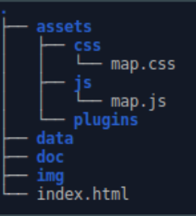

**Ficheros**
- index.html
- assets/js/map.js
- assets/css/map.css


## Práctica 2.- Editar index.html

```
<!DOCTYPE html>
<html>
  <head>
    <meta charset="utf-8">
	<meta name='viewport' content='width=device-width, initial-scale=1.0, maximum-scale=1.0, user-scalable=no, minimal-ui' />
    <title>Taller de Leaflet</title>
  </head>
  <body>
    <div id='map'></div>
  </body>
</html>
```

## Prática 3.- Añadimos recursos externos (Leaflet, JQuery) e internos (map.css y map.js)

[Leaflet Download](http://leafletjs.com/download.html)

```
<!DOCTYPE html>
<html>
<head>
...

  <script src='http://cdn.leafletjs.com/leaflet/v0.7.7/leaflet-src.js'></script>
  <script src="https://code.jquery.com/jquery-3.0.0.min.js"></script>
  <link href='http://cdn.leafletjs.com/leaflet/v0.7.7/leaflet.css' rel='stylesheet' />
  <link rel="stylesheet" href="assets/css/map.css">
...

</head>

<body>
	<div id='map'></div>
	<script src="assets/js/map.js"></script>
</body>
</html>

```

## Práctica 4.- Editamos map.css

```
    body {
        margin: 0;
        padding: 0;
    }
    #map {
        position: absolute;
        top: 0;
        bottom: 0;
        width: 100%;
    }

```

## Práctica 5.- Editamos map.js y añadimos L.map
```
var map = L.map('map', {
    center: [37.88437176085360, -4.779524803161621],
    zoom: 13,
    minZoom: 10,
    maxZoom: 18,
    maxBounds: [[37.65882,-5.01595], [38.03836,-4.33411]]
});

var basemapOSM = L.tileLayer('http://{s}.tile.openstreetmap.se/hydda/full/{z}/{x}/{y}.png', {
  attribution: 'Tiles courtesy of <a href="http://openstreetmap.se/" target="_blank">OpenStreetMap Sweden</a> &mdash; Map data &copy; <a href="http://www.openstreetmap.org/copyright">OpenStreetMap</a>'
});

basemapOSM.addTo(map);

```
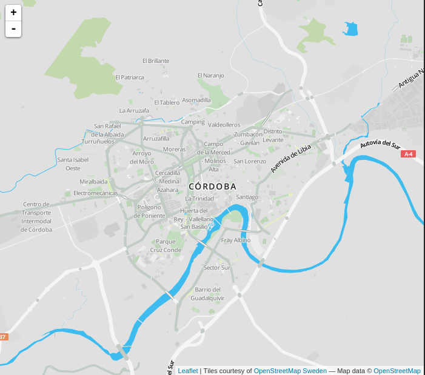

## Práctica 6.- Añadiendo capa vectorial GeoJSON (JQuery)

[Descarga](https://drive.google.com/folderview?id=0B4ae3iJxxLBuOGU1SlFVMjFzbzQ&usp=sharing)

```
var centros = L.geoJson(null);

centros.getAttribution = function() {
 return 'Fuente: <a href="http://www.juntadeandalucia.es/institutodeestadisticaycartografia/DERA/" target="_blank">IECA</a>';
};

$.getJSON("data/centros_educativos.geojson", function (data) {
  centros.addData(data);
});

centros.addTo(map);
```
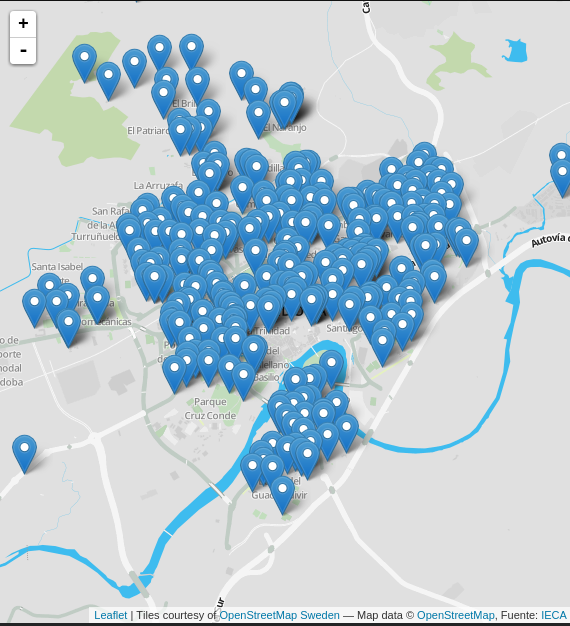

## Práctica 7.- Control de capas

```
var baseMaps = {
    "OSM": basemapOSM
};

var overlayMaps = {
    "Centros educativos": centros
};

L.control.layers(baseMaps, overlayMaps,{
    position: 'topright', // 'topleft', 'bottomleft', 'bottomright'
    collapsed: false // true
}).addTo(map);
```

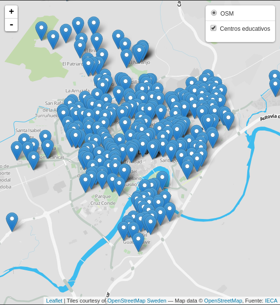

## Práctica 8.- Escala
```
L.control.scale({
  imperial: false
}).addTo(map);

```

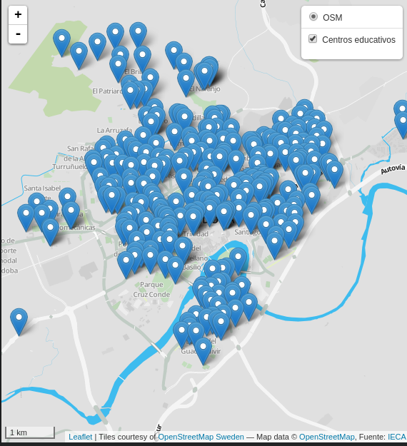

## Práctica 9.- Añadiendo L.tileLayer.WMS, GeoJSON poligonal de parques y cargando en control de capas

[Consulta parques y jardines en Overpass Turbo](http://overpass-turbo.eu/s/gPm)

Catálogo de WMS [IDEE](http://idee.es/web/guest/directorio-de-servicios?p_p_id=DIRSRVIDEE_WAR_DIRSRVIDEEportlet_INSTANCE_q4BW&p_p_lifecycle=1&p_p_state=normal&p_p_mode=view&p_p_col_id=column-1&p_p_col_count=1&_DIRSRVIDEE_WAR_DIRSRVIDEEportlet_INSTANCE_q4BW_descSrv=VISUALIZACION&_DIRSRVIDEE_WAR_DIRSRVIDEEportlet_INSTANCE_q4BW_supertipo=OGC&_DIRSRVIDEE_WAR_DIRSRVIDEEportlet_INSTANCE_q4BW_tipoServicio=WMS)

```
var Spain_PNOA_Ortoimagen = L.tileLayer.wms('http://www.ign.es/wms-inspire/pnoa-ma', {
  layers: 'OI.OrthoimageCoverage',
  format: 'image/png',
  transparent: false,
  continuousWorld : true,
  attribution: 'PNOA cedido por © <a href="http://www.ign.es/ign/main/index.do" target="_blank">Instituto Geográfico Nacional de España</a>'
});

....

var zonasverdes = L.geoJson(null);

$.getJSON("data/parques_osm.geojson", function (data) {
  zonasverdes.addData(data);
});

var baseMaps = {
    "OSM": basemapOSM,
    "PNOA": Spain_PNOA_Ortoimagen
};

var overlayMaps = {
    "Centros educativos": centros,
    "Zonas Verdes" : zonasverdes
};

```

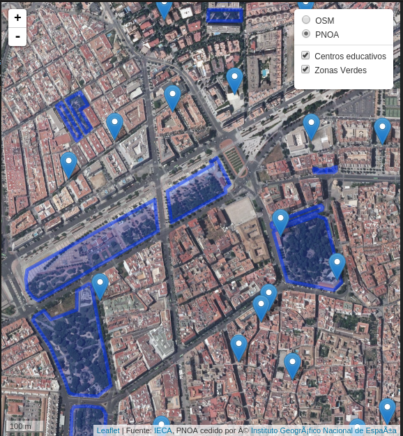

## Práctica 10.- Información de los centros

En index.html **Importante!!!**

```
 <meta charset="utf-8">
```

```
function centrosInfoPopup(feature, layer) {

    layer.bindPopup( "<h4>" + feature.properties.nombre + "</h4>"+"<strong> Tipo: </strong>"+feature.properties.tipo+"<br/>"+ "<strong> Gestión: </strong>"+feature.properties.gestion+"<br/>"+ "<strong> Domicilio: </strong>"+feature.properties.direccion+"<br/>"+ "<strong> Localidad: </strong>"+feature.properties.localidad+"<br/>"+ "<strong> Teléfono: </strong>"+feature.properties.tlfno+"<br/>"+ "<strong> Enseñanza: </strong>"+feature.properties.enseñanza+"<br/>"+ "<strong> Servicios: </strong>"+feature.properties.servicios+"<br/>"+ "<strong> Bilingüe: </strong>"+feature.properties.bilingüe+"<br/>");  
}

var centros = L.geoJson(null, {
  onEachFeature: centrosInfoPopup,
});

```

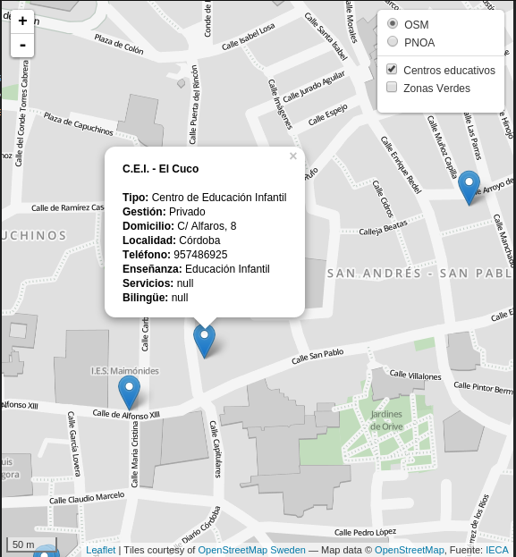

## Práctica 11.- CSS en popup

[Google Fonts](https://fonts.google.com/)

```
@import url(https://fonts.googleapis.com/css?family=Open+Sans);

.leaflet-popup-content {
  font-family: 'Open Sans', sans-serif;
  font-size: 13px;
  font-weight: 400;
  line-height: 22px;
}

```

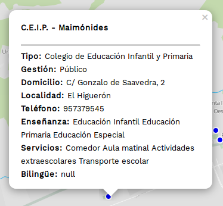

## Práctico 12.- Estilo a la capa poligonal (style)

```
function estiloZonasVerdes(feature) {
  return {
    //weight: 3.3,
    color: 'green',
    opacity: 0.6,
    fillOpacity: 0.5
  };
};

var zonasverdes = L.geoJson(null,{
  style : estiloZonasVerdes,
});
```

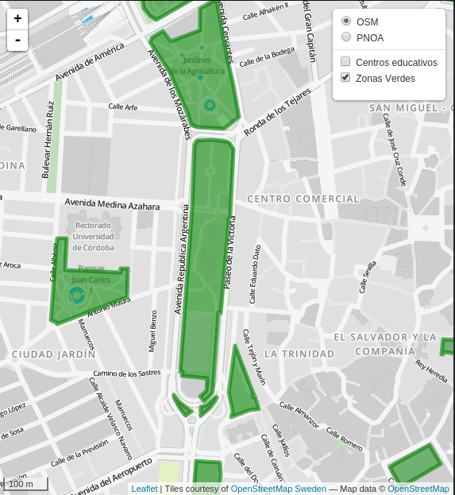

## Práctica 13.- Estilo L.circleMarker para capa centros

```
function estiloCircleMarker(feature, latlng) {
  return L.circleMarker(latlng, {
    radius: 5.0,
    fillColor: 'red',
    color: '#FFFFFF',
    weight: 2,
    opacity: 1.0,
    fillOpacity: 1.0
  })
}

var centros = L.geoJson(null, {
  onEachFeature: centrosInfoPopup,
  pointToLayer: estiloCircleMarker,
});

```

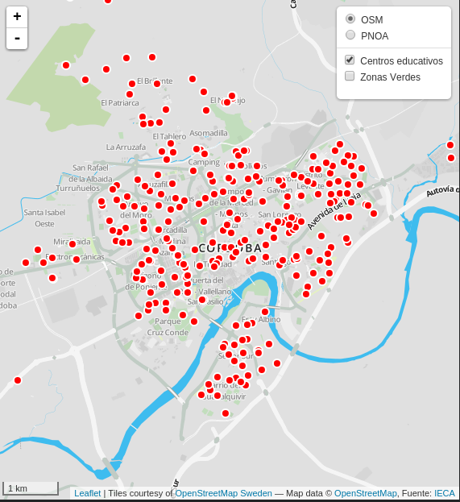

## Práctica 14.- Estilo según atributo gestión
```
function colorGestion(g) {
    return g == 'Público' ? 'blue' :
           g == 'Privado'  ? 'orange' :
                      'red';
}

function estiloCircleMarker(feature, latlng) {
  return L.circleMarker(latlng, {
    radius: 5.0,
    //fillColor: 'red',
    fillColor: colorGestion(feature.properties.gestion),
    color: '#FFFFFF',
    weight: 2,
    opacity: 1.0,
    fillOpacity: 1.0
  })
}

```

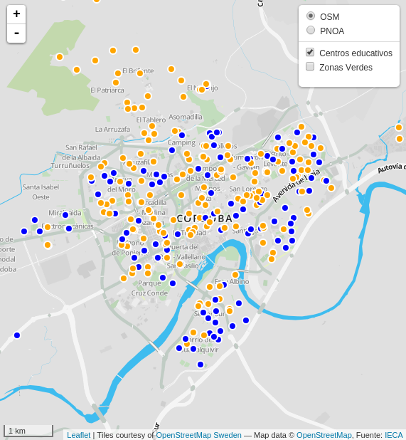

##  Práctica 15.- Utilizar filter para crear dos capas para tipos de gestión

```
var centros_privado = L.geoJson(null, {
  onEachFeature: centrosInfoPopup,
  pointToLayer: estiloCircleMarker,
  filter: function(feature, layer) {
                return feature.properties.gestion == "Privado";
            }
});
```

# Plugins

## Práctica 16. Plugins. Geocoding

[Extensiones de geocoding](http://leafletjs.com/plugins.html#geocoding)

Vamos a utilizar [L.GeoSearch](https://github.com/smeijer/L.GeoSearch)

En index.html

```
  <script src="http://smeijer.github.io/L.GeoSearch/src/js/l.control.geosearch.js"></script>
  <script src="http://smeijer.github.io/L.GeoSearch/src/js/l.geosearch.provider.openstreetmap.js"></script>
  <link rel="stylesheet" href="http://smeijer.github.io/L.GeoSearch/src/css/l.geosearch.css" />
```

En map.js

```
var buscaCalle = new L.Control.GeoSearch({
    provider: new L.GeoSearch.Provider.OpenStreetMap()
});

buscaCalle.addTo(map);
```

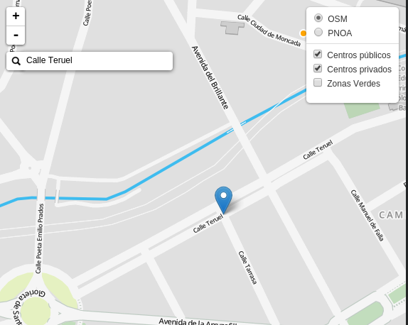

## Práctica 17.- Plugins. Hash
[Interactive pan/zoom](http://leafletjs.com/plugins.html#interactive-panzoom)

leaflet-hash https://github.com/mlevans/leaflet-hash

En index.html
```
<script src="http://mlevans.github.io/leaflet-hash/javascripts/leaflet-hash.js" type="text/javascript"></script>

```


En map.js
```
var hash = new L.Hash(map);
```

## Práctica 18.- Plugins. Locate
[leaflet-locatecontrol]([https://github.com/domoritz/leaflet-locatecontrol/tree/gh-pages])

En index.html

```
<link href="https://maxcdn.bootstrapcdn.com/font-awesome/4.6.3/css/font-awesome.min.css" rel="stylesheet">

<link rel="stylesheet" href="https://www.domoritz.de/leaflet-locatecontrol/dist/L.Control.Locate.min.css" />
<script src="https://www.domoritz.de/leaflet-locatecontrol/src/L.Control.Locate.js" ></script>
```

En map.js

```
var lc = L.control.locate({
    strings: {
        title: "Show me where I am, yo!"
    }
}).addTo(map);

```
## Práctica 19.- Botón de extensión inicial

index.hmtl
```
<body>
	<div id='map'></div>
	<div id='btn-zum'>
 <button type="button">Zum extensión</button>
	<script src="assets/js/map_p21.js"></script>
</div>
</body>
```

map.css
```
#btn-zum{
       position: absolute;
       top: 10px;
       left: 60px;
       z-index: 9000;

}
```
map.js
```
$("#btn-zum").click(function() {
	// map.fitBounds(centros.getBounds());
  map.setView([37.88437176085360, -4.779524803161621], 11);
	return false;
});
```
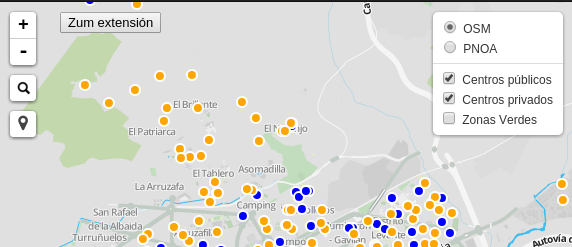
